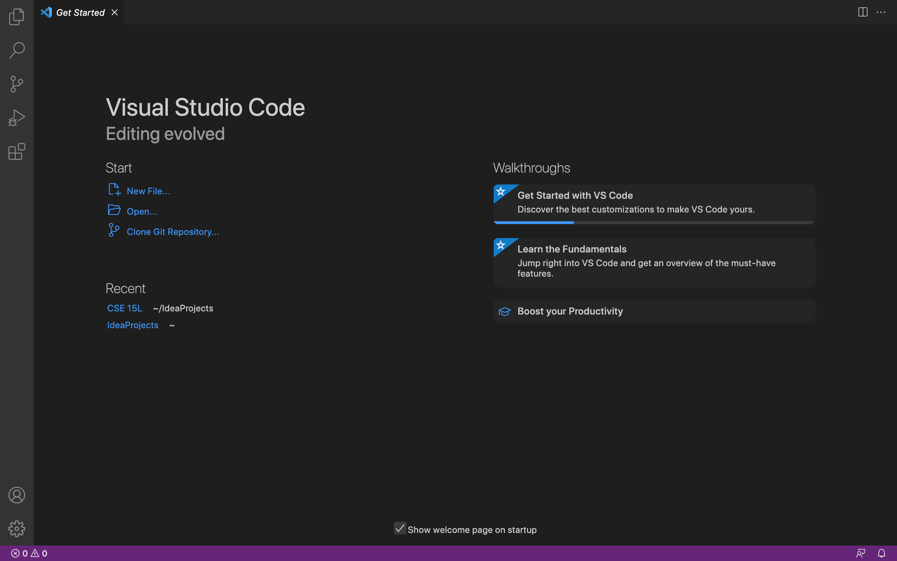

# Week 1 Lab Report
## Installing VScode
 
https://code.visualstudio.com/

Download VSCode suitable for your operating device.
When the application is downloaded and opened, the initial screen should look like this:



---

## Romotely Connecting

Access the Terminal by using the Terminal menu and selecting “New Terminal.” Now type the following `ssh` command (replace lh with letters specific to your course account):
```
$ ssh cs15lfa22lh@ieng6.ucsd.edu
```

Amongst other messages, type yes to the message 

```
Are you sure you want to continue connecting (yes/no/[fingerprint])?
```

After typing the password, your screen should look similar to the following image :


---

## Trying Some Commands

Here are examples of using `pwd`, `cd`, and `ls` in the client and server. The current working directory printed and the listed files are different for each computer. 

* Commands on client:

    

* Commands on server:

    

---

# Moving Files with `scp`

To copy files from the local to remote computer, use the command `scp` or “secure copy.” 

Logout of the remote computer in order to use this command. 
> **Note:** logout using the `exit` command or using Ctrl-D

Use VS Code to create a file named `WhereAmI.java` and write the Lab given code.
Compile and run using `javac` and `java`. 

The output should be:


Then type this command in your (replace with your account name):

```
# on client
$ scp WhereAmI.java cs15lfa22lh@ieng6.ucsd.edu:~/
```

> **Note:** Don't forget the directory path at the end

After typing the password, the screen should look like this:


Login to the server again. Complile and run `WhereAmI.java` to get the new output:


---

# Setting an SSH Key

Use ssh keys to skip the password. 

To start setting up the ssh keys, use the command:

```
$ ssh-keygen
```
When the message :
```
Enter file in which to save the key (/Users/<client name>/.ssh/id_rsa):
```
appears, press `enter` to use the default path.

This created the files `id_rsa` (the private key) and `id_rsa.pub` (the public key). 

Copy the public key to the user account's `.ssh` directory:

```
# on client
$ ssh cs15lfa22lh@ieng6.ucsd.edu
<Enter Password>
```
```
# on server
$ mkdir .ssh
$ <logout>
```
```
# back on client
$ scp /Users/Shol/.ssh/id_rsa.pub cs15lfa22lh@ieng6.ucsd.edu:~/.ssh/authorized_keys
```

Now when logging into the server, a password isn't prompted:


---

# Optimizing Remote Running

To optimize remote running: 

* copy user account name: cs15lfa22lh@ieng6.ucsd.edu
* use Command/Control + S to save files
* combine compile and run commands using semicolons:

    ```
    $ javac WhereAmI.java ; java WhereAmI
    ```
    > **Note:** Use `tab` to autofill words

* combine `scp` and user account login

    ```
    $ scp WhereAmI.java cs15lfa22lh@ieng6.ucsd.edu:~/ ; ssh cs15lfa22lh@ieng6.ucsd.edu
    ```

Image using optimized commands:


