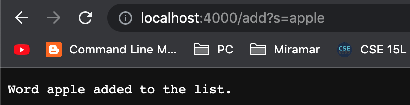
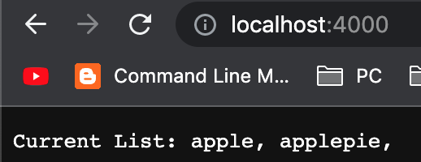
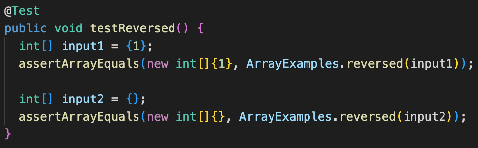
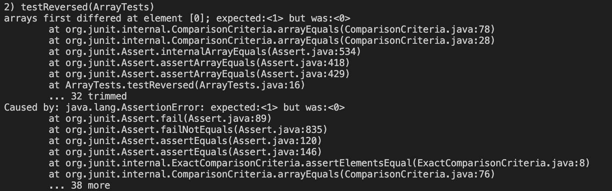
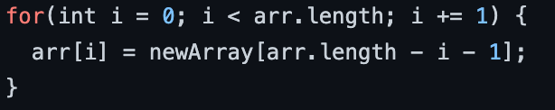
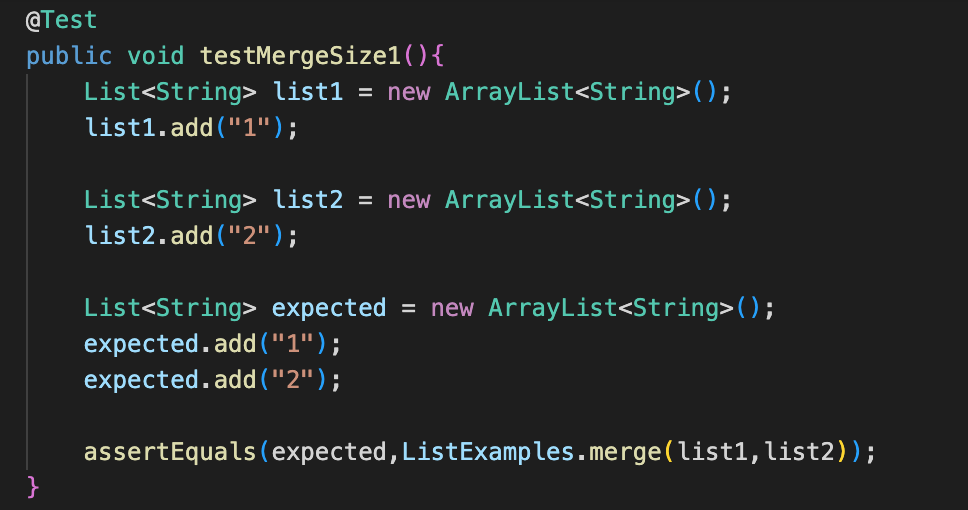
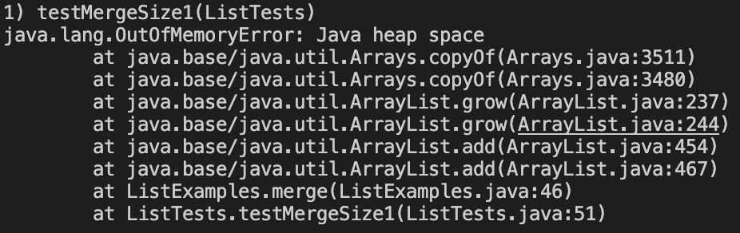
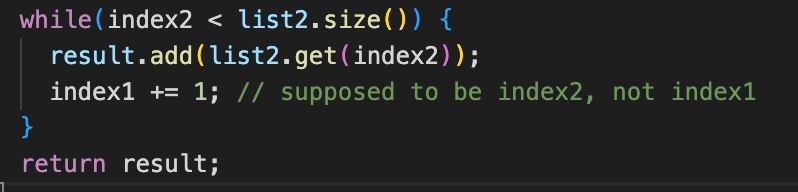

# Week 3 Lab Report 2
## **Part 1**


`SearchEngine.java`:
```
import java.io.IOException;
import java.net.URI;
import java.util.ArrayList;

class Handler implements URLHandler {
    ArrayList<String> words = new ArrayList<String>();

    public String handleRequest(URI url) {
        if (url.getPath().equals("/")) {
            String output = "";
            for(String w: words){
                output += w + ", ";
            }
            return String.format("Current List: %s",output);
        } 
        else {
            System.out.println("Path: " + url.getPath());
            if (url.getPath().contains("/add")) {
                String[] parameters = url.getQuery().split("=");
                if (parameters[0].equals("s")) {
                    words.add(parameters[1]);
                    return String.format("Word %s added to the list.", parameters[1]);
                }
            }
            else if (url.getPath().equals("/search")) {
                String[] parameters = url.getQuery().split("=");
                if (parameters[0].equals("s")){
                    String output = "";
                    for(String w: words){
                     if(w.contains(parameters[1])){
                            output += w + " ";
                        }
                    }
                    return String.format("Search Results: %s\n",output);
                }
                
            }
            
            return "404 Not Found!";
        }
    }
}

class SearchEngine {
    public static void main(String[] args) throws IOException {
        if(args.length == 0){
            System.out.println("Missing port number! Try any number between 1024 to 49151");
            return;
        }

        int port = Integer.parseInt(args[0]);

        Server.start(port, new Handler());
    }
}
```

ScreenShots:

* query example:


* adding example:



* returning list:




*Methods Used:*

`handleRequest(URI url)` was called every time to take in the URL input arguments and produces a response based on the website desrired function.

`main` method creates a URLHandler, which manages the string list and search algorithm used in the website. It also uses Server.java to start a web server using this handler.

*Relevant Arguments and fields:*

At the start of the class, the String ArrayList `word` stores the data input form the URL The argument of `handleRequest(URI url)` is the URL string used to produce the website and commands to modify the page. Within the method

*Changing URL:*

To change the URL, the `handleRequest` is called everytime the web page's URL is modified to re-evaluate the its arguments. The URI argument passed into `handleRequest` therfore changes first, which then calls the proccess to change `word` and the web page's contents based on the new path's arguments. By the end of the request, the web page and stored data in `word` updates accordingly and the URL remains changed until modified again.


---
## **Part 2**

## File 1: `ArrayExamples.java`

* `testReversed`:
    
    error-inducing input:

    

    symptom:

    

    the bug:

    
    
    The symptom was due to the bug line of code where the new array's default elements were set into the original array. The input produced an error because the inital array was not empty and had only zero's as elements. This can be fixed by simply swapping the array's location in the code, so the the new array is updated instead of the original one.


## File 2: `ListExamples.java`

* `merge`:

    error-inducing input:

    

    symptom:
    
    
    
    the bug:
    
    
    
    index2 is never incremented when merging its remaining elements at the end of the method. Therefore the element in the second list where index2 is stuck on never stops adding onto the merged array list, hence the memory error. To fix this, replace index1 with index2 in this section.

        
