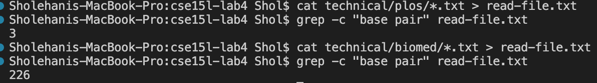
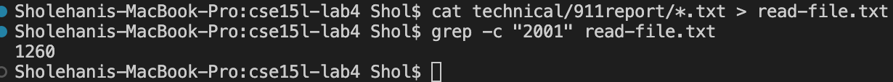
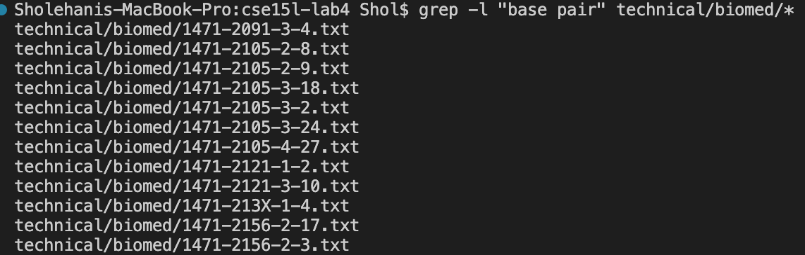
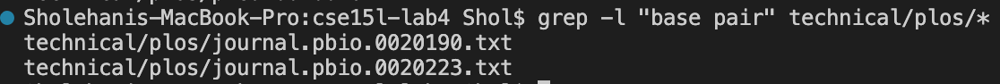
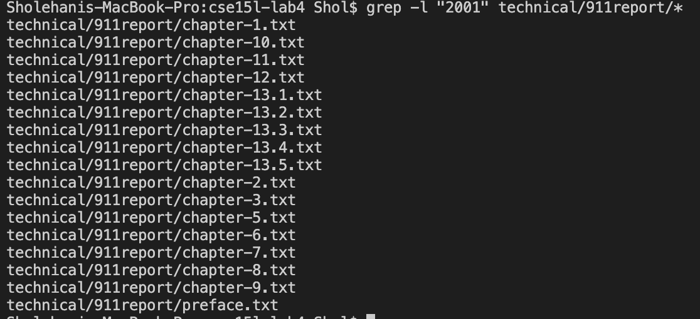
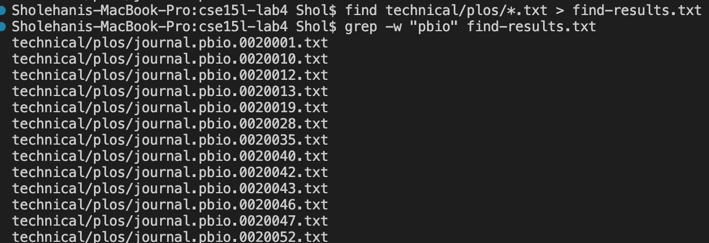
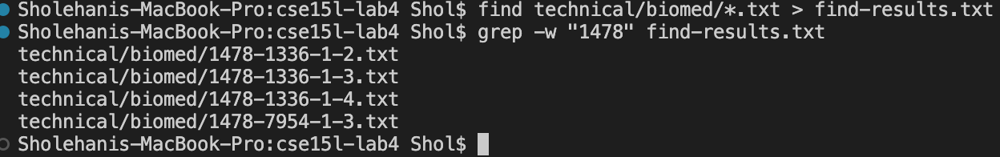
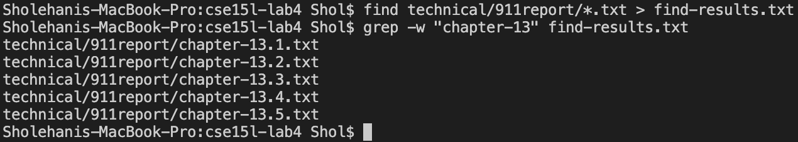

# Week 5 Lab Report

## `grep` commands
---

## `-c` option: 

> Each example above gives the total count of files in the directories plos and biomed that contain the phrase "base pair." This is useful in finding the number of files that relate to the topic of "base pairs" and understand which directory contains more files relating this topic.

> This example gives the total count of files in the 911report directory that contain refer to the year/number 2001. This is useful in understanding the scale of files that refer to this time period.

---

## `-l` option:

>This example lists files in the biomed directory that contains the phrase "base pair." This is useful for finding specific files relating to the topic "base pairs."

> This example lists files in the plos directory that contains the phrase "base pair." This is useful for knowing which files relate to the topic "bases pairs."

> This example lists files in the 911report directory that refer to the year/number 2001. This is useful in knowing which files refer to informatoin related to this year/number.

---

## `w` option:

> This example finds files names in the plos directory that contain the phrase "pbio." This is useful in finding the files that that belong within the catagory "pbio."

> This example finds files in the biomed directory that contain the phrase "1478." This is useful in finding files within the "1478" category while ignoring the rest of the directory's file categories.

> This example finds files in the 911report directory that have the phrase "chapter-13." This is useful in only finding chapter 13 context and view its sections.