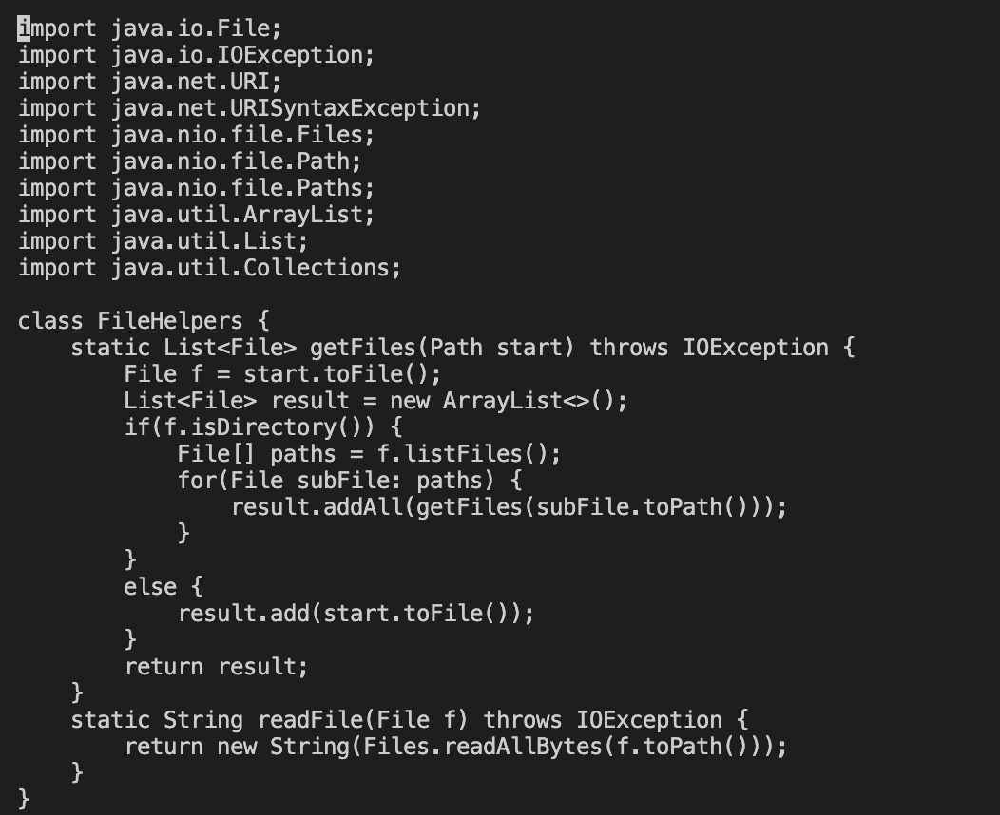
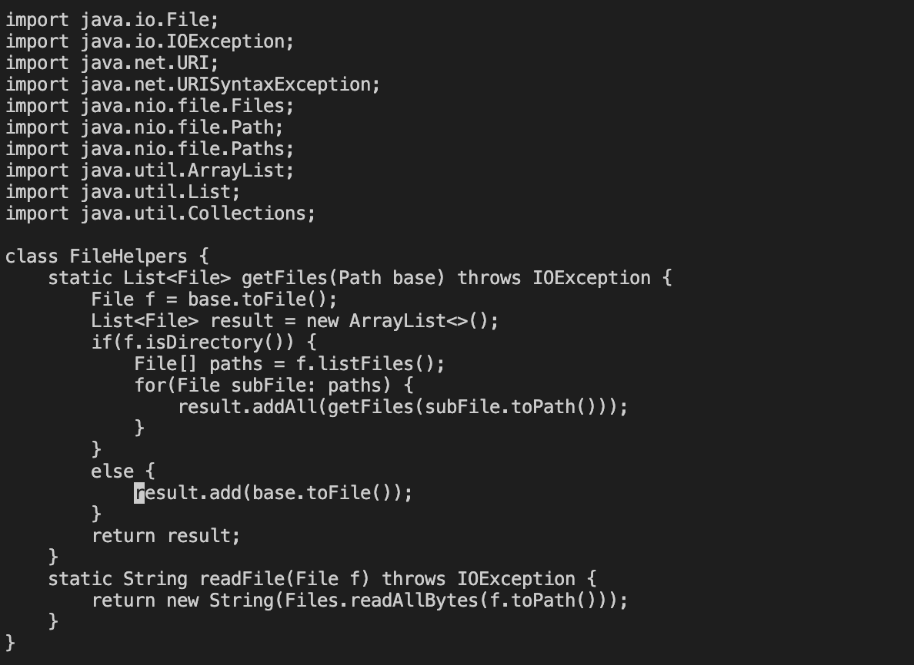

# Week 7 Lab Report
## **Part 1**
---
**Task:**
* In DocSearchServer.java, change the name of the start parameter of getFiles, and all of its uses, to instead be called base.

Full sequence of `vim` commands:
```
:s/start/base/ 27 <enter>
:wq <enter>
```
Total keys pressed: **22**

---

* Before commands:



* After command:

 ```
 :s/start/base/ 27 <enter> 
 ```



The following command used is called the *substitute* command, which has the same fuction as fins and replace. The first word is to search and the second one is to replace it with. 

The line responsible for the cursor to move specifically to the end of the `FileHelpers` method is the `27`, which specifies the command to only replace the occurances of "start" up to line 27 of the file.

* After command: `:wq`

The file's changes are saved through the `w` command and is exited with the `q` command.

---

## **Part 2**
---
**Time Recordings:**
* Using VSC: **29.8 seconds**
    * Difficulties: 
        * setting extra putting `scp` and `ssh` command into command history 
            * extra effort to reduce time spent in local
        * misspelled remote directory name `week6-skill-demo1` 
            * can't use `<tab>` to autofill remote directory from local

* Using Vim: **27.4 seconds**
    * Difficulties:
        * had to use `:set number` to first find the line number the *subsitute* command has to stop at

**Questions:**

Which of these two styles would you prefer using if you had to work on a program that you were running remotely, and why?

> I would perfer using Vim simply because it is already in built into the remote and savese time `scp` files.


What about the project or task might factor into your decision one way or another? (If nothing would affect your decision, say so and why!)

> The scale of the task, features within the remote that need to be used, and the amount of files to edit are a few things that would change which editor I would use. The ease of using a mouse in local would help me make changes quicker as I am not too familiar with Vim at the moment. But the access to the remote exclusive features would make testing and editting files easier while using Vim.
