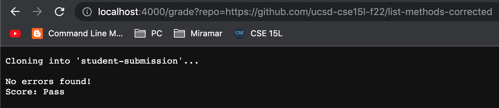
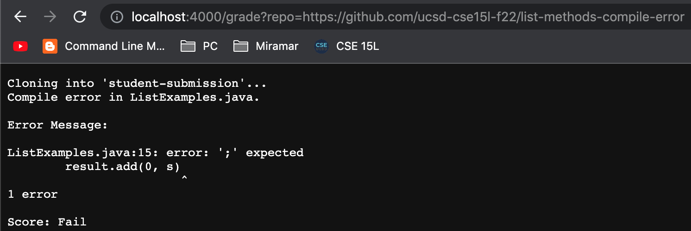
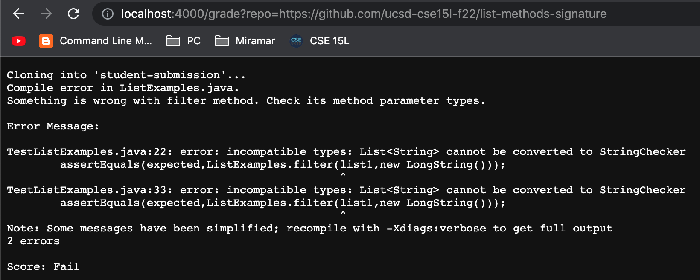

# Week 8 Lab Report
## `grade.sh` file:
```
rm -rf student-submission
git clone $1 student-submission

if [[ ! -f student-submission/ListExamples.java ]]
then
    if [[ -e student-submission/ListExamples.java ]]
    then
        echo -e "\nFile \"ListExamples.java\" is located in another directory."
        echo -e "\nScore: Fail\n"
        exit
    else
        echo -e "\nFile \"ListExamples.java\" not found."
        echo -e "\nScore: Fail\n"
        exit
    fi
fi

cp TestListExamples.java student-submission

cd student-submission/

javac -cp .:../lib/hamcrest-core-1.3.jar:../lib/junit-4.13.2.jar *.java 2> compile-error.txt
if [[ $? -ne 0 ]]
then
    echo -e "Compile error in ListExamples.java."
    if grep -q "filter" compile-error.txt; then
        echo "Something is wrong with filter method. Check its method parameter types."
    fi
    if grep -q "merge" compile-error.txt; then
        echo "Something is wrong with merge method. Check its method parameter types."    
    fi
    
    echo -e "\nError Message:\n"
    cat compile-error.txt
    echo -e "\nScore: Fail\n"
    exit
fi

java -cp .:../lib/hamcrest-core-1.3.jar:../lib/junit-4.13.2.jar org.junit.runner.JUnitCore TestListExamples > test-results.txt

if grep -q "Failure" test-results.txt; then
    echo -e "Some test failed. Review following test output to fix error(s):\n"
    cat test-results.txt
    echo -e "\nScore: Fail\n"
    exit
fi

echo -e "\nNo errors found!\nScore: Pass\n"
```
## Screenshots:
* Grading ***https://github.com/ucsd-cse15l-f22/list-methods-corrected** repository:



* Grading **https://github.com/ucsd-cse15l-f22/list-methods-compile-error** repository:



* Grading **https://github.com/ucsd-cse15l-f22/list-methods-signature** repository:




## Trace:
Example: https://github.com/ucsd-cse15l-f22/list-methods-compile-error


```
rm -rf student-submission
```
* No standard output and error. Exit code: 0
```
git clone $1 student-submission
```
* No standard output. Standard Error output: 
> ```
> Cloning into 'student-submission'...
> ```
* Exit code: 0
```
if [[ ! -f student-submission/ListExamples.java ]]
```
* False: the `-f` command returned true but the negation made it false.
```
if [[ -e student-submission/ListExamples.java ]]
then
    echo -e "\nFile \"ListExamples.java\" is located in another directory."
    echo -e "\nScore: Fail\n"
    exit
else
    echo -e "\nFile \"ListExamples.java\" not found."
    echo -e "\nScore: Fail\n"
    exit
fi
```
* Lines above do not run do to the previous `if` statement being false
```
cp TestListExamples.java student-submission
```
* No standard output and error. Exit code: 0
```
cd student-submission/
```
* No standard output and error. Exit code: 0
```
javac -cp .:../lib/hamcrest-core-1.3.jar:../lib/junit-4.13.2.jar *.java 2> compile-error.txt
```
* No standard output. Standard Error output: 
> ```
> ListExamples.java:15: error: ';' expected
>    result.add(0, s)
>                    ^
> 1 error
> ```
* Exit code: 1
```
if [[ $? -ne 0 ]]
```
* True: the previous exit code does not equal zero
```
echo -e "Compile error in ListExamples.java."
```
* No standard error. Standard Output : 
> Compile error in ListExamples.java.
* Exit Code: 0
```
if grep -q "filter" compile-error.txt
``` 
* False: the compile error did not involve the `filter` method
```
    echo "Something is wrong with filter method. Check its method parameter types."
```
* Line above do not run due to the previous if statement
```
if grep -q "merge" compile-error.txt; then
    echo "Something is wrong with merge method. Check its method parameter types."
```
* False: the compile error did not involve the `merge` method
```   
echo -e "\nError Message:\n"
```
* No standard error. Standard Output : 
> Error Message:
* Exit Code: 0
```
cat compile-error.txt
```
* No standard error. Standard Output : 
> ```
> ListExamples.java:15: error: ';' expected
>    result.add(0, s)
>                    ^
> 1 error
> ```
* Exit code: 0
```
echo -e "\nScore: Fail\n"
```
* No standard error. Standard Output : 
> Score: Fail
* Exit Code: 0
```
exit
```
* No standard error and standard output.
* Exit Code: 0

```
java -cp .:../lib/hamcrest-core-1.3.jar:../lib/junit-4.13.2.jar org.junit.runner.JUnitCore TestListExamples > test-results.txt
```
```
if grep -q "Failure" test-results.txt; then
    echo -e "Some test failed. Review following test output to fix error(s):\n"
    cat test-results.txt
    echo -e "\nScore: Fail\n"
    exit
fi

echo -e "\nNo errors found!\nScore: Pass\n"
```
* Lines above are not ran due to the previous `exit` command, which stops the `grade.sh` file
